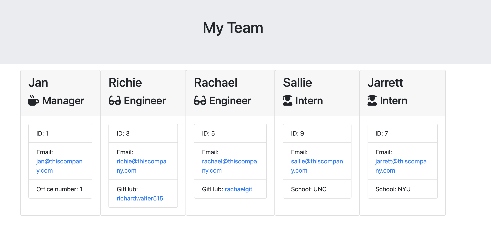

# teamProfiles

## Table of Contents
  1. [Description](#description)
  2. [Image of product](#screenshots)
  3. [Usage](#usage)
  4. [Questions](#questions)
  
  
  
## Description 
This application is designed to gather information via inquirer in node.js and use the data to render an HTML site that displays relevant information about members of your team.

## Image of product 

## Usage 
To use, simply answer the questions promted when node runs "app.js", and your team.html file will appear in the "output" folder.

Watch a video of the app in use [here](https://drive.google.com/file/d/1oJdad_7wvqVFav76z3uOnLAYwMQt-aB0/view).

## Questions 
If you have any questions, you may reach out to me at richardwalter515@gmail.com
or visit me on [GitHub](https://www.github.com/richardwalter515)